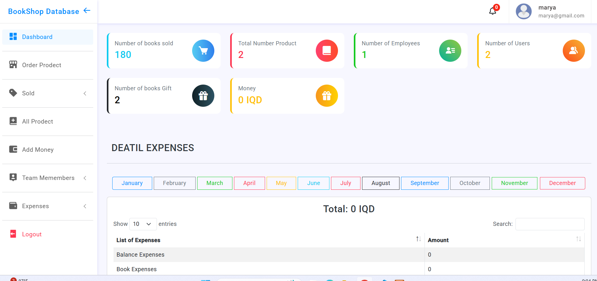

# 📚 Book Management System

A complete Laravel-based Book Management System to manage users, employees, books, sales, gifts, expenses, invoices, and more. Built with simplicity and usability in mind, this system is perfect for small businesses, educational centers, or anyone needing to track books and finances.

---

## ✨ Features

### 🔐 User & Employee Management
- Add, update, or delete users
- Secure login system using email and password
- Add and manage employees
- Assign salaries to employees

### 💼 Salary & Expense Management
Track and manage all types of expenses, including:
- Employee Expenses
- Rental Expenses
- Book Expenses
- Balance Expenses
- Learning Expenses
- Reklam (Advertising) Expenses
- Course Expenses
- Office Expenses
- Technological Expenses
- Exhibition Expenses
- Personal Expenses

Each expense type is saved, and total expenses are calculated and shown clearly.

### 📦 Book Management
- Add, edit, delete books
- Sell or gift books
- Manage book quantity
- Get notifications when quantity reaches **0**
- Search and filter through all books

### 🧾 Order & Invoicing
- Create book orders
- Generate and save invoices for each sale

### 📊 Dashboard Overview
Your dashboard includes:
- Number of books sold
- Total number of products
- Number of employees
- Number of users
- Number of gifted books
- Total money (in IQD)
- A full breakdown of all expenses

---

## 🖼️ Screenshots

### 📸 Dashboard Preview  


### 🔐 Login Page  


---

## ⚙️ Tech Stack

- **Backend:** Laravel 9+
- **Frontend:** Blade, Bootstrap/CSS ,html , js 
- **Database:** MySQL
- **Authentication:** Laravel built-in Auth system

---

## 🚀 Getting Started

### 1. Clone the Repository

```bash
git clone https://github.com/Marya69/book-manager-system.git
cd book-manager-system

